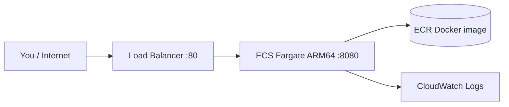

# URL Shortener — Step-by-Step Guide (Why + Easy Commands)

This guide explains **what to do first, why, and what comes next**.  
You do **not** need to run dozens of terminal commands — use the **scripts** in `scripts/`.

---

## One-time setup (do this once)

| Step | Why | What to do |
|------|-----|------------|
| 1 | Run containers | Install [Docker Desktop](https://www.docker.com/products/docker-desktop) |
| 2 | Talk to AWS | Install [AWS CLI](https://docs.aws.amazon.com/cli/latest/userguide/getting-started-install.html) |
| 3 | Create infrastructure | Install [Terraform](https://developer.hashicorp.com/terraform/install) — **ARM version** on Apple Silicon (`darwin_arm64`) |
| 4 | AWS account for this project | Create IAM user `terraform-user` with `AdministratorAccess` |
| 5 | CLI access | `aws configure --profile terraform-user` (access key + secret + region `us-east-1`) |

**Test setup:**

```bash
export AWS_PROFILE=terraform-user
aws sts get-caller-identity
terraform version   # must show darwin_arm64 on M1/M2/M3 Mac
```

---

## Scripts cheat sheet (use these instead of manual commands)

Every script in `scripts/` has **line-by-line comments** explaining what each part does — open any `.sh` file to read along while learning.

From the **project root**:

| Script | What it does |
|--------|----------------|
| `./scripts/local.sh` | Build + run app on `http://localhost:8080` |
| `./scripts/plan.sh dev` | **Preview** infra changes only (no apply) |
| `./scripts/deploy.sh dev` | Plan → review → apply → ECR → ECS (full deploy) |
| `./scripts/deploy.sh prod` | Same for prod (2 tasks, auto-scaling) — see [PROD.md](./PROD.md) |
| `./scripts/redeploy-app.sh dev` | **App code only** — image push + ECS (no Terraform) |
| `./scripts/status.sh` | Show ECS + ALB health |
| `./scripts/test-api.sh` | Test `/health`, `/shorten`, redirect |
| `./scripts/destroy.sh dev` | **Delete all AWS resources** |

**Always set profile first** (add to `~/.zshrc` if you like):

```bash
export AWS_PROFILE=terraform-user
export AWS_REGION=us-east-1
```

---

## Phase 1 — Run locally (learn the app)

### What & why

| What | Why |
|------|-----|
| Flask API (`app.py`) | Handles shorten + redirect |
| Docker | Same image runs on your laptop and on AWS |
| Port 8080 | App listens here; Docker maps it to your machine |

### Easy command

```bash
./scripts/local.sh
```

### Test (another terminal)

```bash
./scripts/test-api.sh http://localhost:8080
```

### What you should see

- Container logs: `Running on http://0.0.0.0:8080`
- Tests print `All tests passed`

---

## Phase 2 — AWS credentials (terraform-user)

### What & why

| What | Why |
|------|-----|
| IAM user `terraform-user` | Never use root; separate from work accounts (Expedient, etc.) |
| Access keys | AWS CLI + Terraform need programmatic access |
| Profile `terraform-user` | Keeps this project separate from `expedient` / `pulumi-dev` |

### Easy command

```bash
export AWS_PROFILE=terraform-user
aws sts get-caller-identity
```

**Expected:** `"Arn": "...:user/terraform-user"`

---

## Phase 3 — Deploy everything to AWS (one command)

### What happens inside `./scripts/deploy.sh`

| Step | What | Why |
|------|------|-----|
| **1** | `terraform apply` | Creates VPC, ALB, ECS, ECR, security groups, logs |
| **2** | Build + push Docker image | ECS pulls from ECR (not your laptop) |
| **3** | `ecs update-service --force-new-deployment` | Running tasks use the new image |
| **4** | Wait for healthy | ALB only sends traffic when `/health` returns 200 |

### Easy command (dev — 1 ECS task)

```bash
export AWS_PROFILE=terraform-user
./scripts/deploy.sh dev
```

### Easy command (prod — 2 tasks + auto-scaling)

```bash
export AWS_PROFILE=terraform-user
./scripts/deploy.sh prod
```

First run asks `yes` in Terraform. To skip confirmation:

```bash
AUTO_APPROVE=1 ./scripts/deploy.sh dev
```

### After deploy

```bash
./scripts/status.sh
./scripts/test-api.sh
```

**Expected:** API URL like `http://url-shortener-alb-xxxxx.us-east-1.elb.amazonaws.com` and `{"status":"ok"}`

---

## Phase 4 — What Terraform created (understand the live system)



| AWS piece | Why it exists |
|-----------|----------------|
| **ECR** | Stores your Docker image in AWS |
| **VPC + subnets** | Private network for ECS and ALB |
| **ALB** | Public URL; health checks on `/health` |
| **ECS Fargate** | Runs containers without managing servers |
| **Security groups** | Internet → ALB only; ALB → containers only |
| **CloudWatch** | Container logs for debugging |

### Important: ARM64

- Mac builds **ARM** images → ECS task uses **ARM64** Fargate (`runtime_platform` in Terraform).
- If you see `exec format error` in logs, re-run `./scripts/deploy.sh`.

---

## Phase 5 — Update app after code changes

> Full decision table and Terraform concepts: **[TERRAFORM.md](./TERRAFORM.md)**

| You changed | Run |
|-------------|-----|
| `app.py` / Dockerfile only | `./scripts/redeploy-app.sh dev` |
| `infra/*.tf` or task count | `./scripts/plan.sh dev` then `./scripts/deploy.sh dev` |
| Preview infra only | `./scripts/plan.sh dev` or `prod` |
| Not sure | `./scripts/deploy.sh dev` (always works) |

You changed `app.py`? Redeploy image only (faster than full Terraform):

```bash
export AWS_PROFILE=terraform-user
./scripts/deploy-image.sh

aws ecs update-service \
  --cluster url-shortener-cluster \
  --service url-shortener-service \
  --force-new-deployment \
  --region us-east-1

./scripts/status.sh
./scripts/test-api.sh
```

Or run full deploy again: `./scripts/deploy.sh dev`

---

## Phase 6 — Destroy everything (stop AWS charges)

### What & why

| What | Why |
|------|-----|
| `terraform destroy` | Deletes all resources Terraform created |
| Confirmation | Prevents accidental deletion |

### Easy command (recommended — handles ECR automatically)

```bash
export AWS_PROFILE=terraform-user
./scripts/destroy.sh dev
```

Type **`destroy`** when prompted.

**You do not need to run manual commands in `infra/`.** The script runs the same steps that fixed the ECR error:

```bash
# All of this is automated inside ./scripts/destroy.sh:
aws ecr delete-repository --repository-name url-shortener --force --region us-east-1
terraform state rm aws_ecr_repository.url_shortener
terraform destroy -var-file=terraform.tfvars
```

| Step | Why |
|------|-----|
| `ecr delete-repository --force` | Deletes images + repo (fixes `RepositoryNotEmptyException`) |
| `terraform state rm ...` | State matches AWS after CLI deleted ECR |
| `terraform destroy` | Removes VPC, ECS, ALB, IAM, logs |

**Success when re-running:** `No objects need to be destroyed` / `0 destroyed` means AWS is already clean — that is OK.

**Script runs automatically:** Scripts set `AWS_PAGER=""` so AWS CLI never pauses at `(END)` waiting for you to press `q`.

For prod settings:

```bash
./scripts/destroy.sh prod
```

Auto-approve (skip Terraform confirmation only):

```bash
AUTO_APPROVE=1 ./scripts/destroy.sh dev
```

### What gets deleted

- ECS cluster, service, tasks  
- Application Load Balancer  
- VPC, subnets, internet gateway  
- ECR repository  
- IAM execution role, security groups  
- CloudWatch log group  

### What is NOT deleted

- Local Docker images (`url-shortener` on your Mac)  
- IAM user `terraform-user` (delete manually in console if needed)  
- `~/.aws/credentials` profiles  

### Verify destroy

```bash
aws ecs list-clusters --region us-east-1
# url-shortener-cluster should be gone

cd infra && terraform show
# should show no resources or state empty
```

---

## Troubleshooting

| Problem | Fix |
|---------|-----|
| `503` on ALB | `./scripts/status.sh` — wait 2–3 min or re-run `./scripts/deploy.sh dev` |
| `running: 0` | Deployment in progress; wait, then `./scripts/status.sh` |
| `exec format error` | Re-run `./scripts/deploy.sh` (ARM64 task + ARM image) |
| Wrong AWS account | `export AWS_PROFILE=terraform-user` |
| Terraform lock error | `rm -f infra/.terraform.tfstate.lock.info` |
| Plugin timeout | Use Terraform `darwin_arm64` |
| Expedient vs terraform-user | Never use plain `aws configure` — use `--profile terraform-user` |

### View logs

```bash
aws logs tail /ecs/url-shortener --follow --region us-east-1
```

---

## Manual commands (if you prefer)

<details>
<summary>Click to expand full manual flow</summary>

```bash
# Local
docker build --platform linux/arm64 -t url-shortener .
docker run -p 8080:8080 url-shortener

# Deploy
export AWS_PROFILE=terraform-user
cd infra && terraform init && terraform apply -var-file=terraform.tfvars
cd .. && ./scripts/deploy-image.sh
aws ecs update-service --cluster url-shortener-cluster \
  --service url-shortener-service --force-new-deployment --region us-east-1

# Test
curl $(cd infra && terraform output -raw api_url)/health

# Destroy
cd infra && terraform destroy -var-file=terraform.tfvars
```

</details>

---

## File map

| File | Purpose |
|------|---------|
| `app.py` | Flask API |
| `Dockerfile` | Container recipe |
| `infra/` | All Terraform (VPC, ECS, ALB, ECR) |
| `scripts/deploy.sh` | One-command deploy |
| `scripts/destroy.sh` | One-command teardown |
| `scripts/test-api.sh` | One-command API tests |
| `ROADMAP.md` | Deeper architecture + env variable reference |
| `plan.md` | Original tutorial with inline comments |

---

*Work through Phase 1 → 3 → test → destroy when finished learning.*
