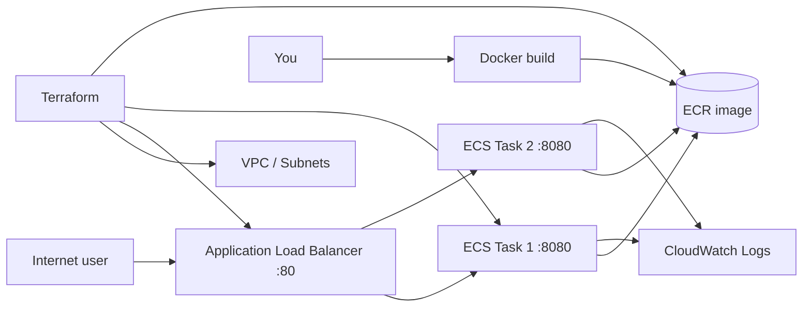

# URL Shortener — Roadmap, Architecture & Operations Guide

This document explains the **full journey** from your laptop to live AWS, **why every major file and setting exists**, and **where to obtain each environment value**.

Work through phases in order. Each phase depends on the previous one.

---

## Table of contents

1. [Roadmap overview](#1-roadmap-overview)
2. [Architecture diagram](#2-architecture-diagram)
3. [Environment variables — complete reference](#3-environment-variables--complete-reference)
4. [Phase 1 — Run locally with Docker](#4-phase-1--run-locally-with-docker)
5. [Phase 2 — AWS account & Terraform (ECR)](#5-phase-2--aws-account--terraform-ecr)
6. [Phase 3 — Push image to ECR](#6-phase-3--push-image-to-ecr)
7. [Phase 4 — Deploy to production (ECS + ALB)](#7-phase-4--deploy-to-production-ecs--alb)
8. [Phase 5 — Production hardening](#8-phase-5--production-hardening)
9. [File-by-file: why each line exists](#9-file-by-file-why-each-line-exists)
10. [Troubleshooting](#10-troubleshooting)

---

## 1. Roadmap overview

| Phase | Goal | You will have |
|-------|------|----------------|
| **1** | Containerise the API | Flask app running in Docker on `localhost:8080` |
| **2a** | AWS access | IAM user, AWS CLI configured |
| **2b** | Infrastructure as code | ECR repository created by Terraform |
| **3** | Image in the cloud | Docker image pushed to ECR |
| **4** | Live API | VPC, ALB, ECS Fargate serving traffic on a public URL |
| **5a** | Scale & observe | Auto-scaling, CloudWatch alarms, logs |
| **5b** | Team-ready state | S3 remote state, Terraform workspaces (optional) |

**Local** = Phases 1 only (Docker on your machine).  
**Production** = Phases 2–4 (and optionally 5).

---

## 2. Architecture diagram



**Traffic path:** User → ALB (port 80) → ECS tasks (port 8080). Users never talk to containers directly; security groups enforce that.

---

## 3. Environment variables — complete reference

### Application (Flask)

| Variable | Required? | Default | Where to get it |
|----------|-----------|---------|-----------------|
| `BASE_URL` | No | `http://localhost:8080` | **Local:** leave default or set in `.env`. **Production:** Terraform sets this to `http://<your-alb-dns>` in the ECS task definition — you do not set it manually after deploy. |

Copy the template:

```bash
cp .env.example .env
```

Only `BASE_URL` is read by the Flask app. Edit `.env` if you run on a different port or hostname locally.

### AWS CLI / deployment (shell)

| Variable | Required? | Where to get it |
|----------|-----------|-----------------|
| `AWS_ACCOUNT_ID` | For ECR push | `aws sts get-caller-identity --query Account --output text` |
| `AWS_REGION` | Yes | Choose once (e.g. `us-east-1`). Must match `infra/terraform.tfvars` and `aws configure`. |
| `AWS_ACCESS_KEY_ID` | For CLI | **AWS Console → IAM → Users → your user → Security credentials → Create access key** |
| `AWS_SECRET_ACCESS_KEY` | For CLI | **Same CSV file** when the key is created (download immediately; cannot view again) |

**Recommended:** run `aws configure` instead of putting keys in `.env`. Credentials are stored in `~/.aws/credentials`.

```bash
aws configure
# AWS Access Key ID:     from IAM CSV
# AWS Secret Access Key: from IAM CSV
# Default region:        us-east-1
# Default output:        json
```

Verify:

```bash
aws sts get-caller-identity
```

### Derived (you build these — not secrets)

```bash
export AWS_ACCOUNT_ID=$(aws sts get-caller-identity --query Account --output text)
export AWS_REGION=us-east-1
export ECR_URI="${AWS_ACCOUNT_ID}.dkr.ecr.${AWS_REGION}.amazonaws.com/url-shortener"
```

`ECR_URI` comes from Terraform output `ecr_uri` after `terraform apply`.

### Terraform variables (not env vars — in `.tfvars` files)

| File | Purpose |
|------|---------|
| `infra/terraform.tfvars` | Dev: 1 task, no auto-scaling (copy from `terraform.tfvars.example`) |
| `infra/prod.tfvars` | Prod: 2 tasks, auto-scaling 2–10 |

These are **not** secrets. `terraform.tfvars` is gitignored so each developer can use different counts without committing personal choices.

---

## 4. Phase 1 — Run locally with Docker

### Why Docker first?

The same image runs on your laptop and on ECS. If it works locally, behaviour on AWS is predictable.

### Steps

```bash
cd /path/to/aws-ecs-terraform-url-shortener

docker build -t url-shortener .
docker run -p 8080:8080 url-shortener
```

| Flag / command | Why it exists |
|----------------|---------------|
| `docker build -t url-shortener` | Builds an image from `Dockerfile`; `-t` names it for later `docker run` |
| `docker run -p 8080:8080` | Maps **host** port 8080 to **container** port 8080 so you can use `curl localhost:8080` |
| `host="0.0.0.0"` in `app.py` | Flask must listen on all interfaces inside the container; `127.0.0.1` only would block Docker port mapping |

### Test locally

```bash
curl http://localhost:8080/health

curl -X POST http://localhost:8080/shorten \
  -H "Content-Type: application/json" \
  -d '{"url": "https://www.google.com"}'

curl http://localhost:8080/all
```

### Run without Docker (optional)

```bash
python3 -m venv .venv
source .venv/bin/activate
pip install -r requirements.txt
python app.py
```

---

## 5. Phase 2 — AWS account & Terraform (ECR)

### 5a — Create AWS account and IAM user

1. Sign up: https://aws.amazon.com/free  
2. **Do not use the root user for CLI.** Create an IAM user (e.g. `terraform-user`) with programmatic access.  
3. For learning, attach `AdministratorAccess` (tighten policies in real companies).  
4. **Download the access key CSV** — secret is shown once.

### 5b — Create ECR with Terraform

```bash
cd infra
cp terraform.tfvars.example terraform.tfvars   # if terraform.tfvars does not exist
terraform init
terraform plan
terraform apply -var-file=terraform.tfvars
```

Save output **`ecr_uri`** — you need it for Phase 3.

| Terraform command | Why |
|-------------------|-----|
| `init` | Downloads AWS provider plugin |
| `plan` | Dry run — shows what will be created without changing AWS |
| `apply` | Creates resources (ECR, and on full apply: VPC, ECS, ALB, etc.) |

---

## 6. Phase 3 — Push image to ECR

ECS cannot pull images from your laptop. You push to **ECR** (AWS’s private Docker registry).

```bash
export AWS_ACCOUNT_ID=$(aws sts get-caller-identity --query Account --output text)
export AWS_REGION=us-east-1

# Or use the helper script from project root:
./scripts/deploy-image.sh
```

Manual equivalent:

```bash
aws ecr get-login-password --region $AWS_REGION | \
  docker login --username AWS --password-stdin \
  $AWS_ACCOUNT_ID.dkr.ecr.$AWS_REGION.amazonaws.com

docker build -t url-shortener .
docker tag url-shortener:latest $ECR_URI:latest
docker push $ECR_URI:latest
```

| Step | Why |
|------|-----|
| `get-login-password` | ECR uses temporary token auth, not your IAM password |
| `docker tag` | Gives the local image the full ECR URL so `docker push` knows the destination |
| `docker push` | Uploads layers; ECS pulls `:latest` on deploy |

Verify:

```bash
aws ecr list-images --repository-name url-shortener --region us-east-1
```

---

## 7. Phase 4 — Deploy to production (ECS + ALB)

If you only ran Phase 2b before, run a **full** apply now (networking + ECS modules are in the same codebase):

```bash
cd infra
terraform apply -var-file=prod.tfvars
```

Wait 3–5 minutes. Note outputs:

- **`api_url`** — public HTTP URL (ALB DNS name)  
- **`ecr_uri`** — registry for future image pushes  

### After pushing a new app version

ECS does not automatically redeploy when you push a new image tag. Force a rollout:

```bash
aws ecs update-service \
  --cluster url-shortener-cluster \
  --service url-shortener-service \
  --force-new-deployment \
  --region us-east-1
```

### Test production

```bash
ALB_URL="http://url-shortener-alb-XXXX.us-east-1.elb.amazonaws.com"   # from terraform output

curl $ALB_URL/health

curl -X POST $ALB_URL/shorten \
  -H "Content-Type: application/json" \
  -d '{"url": "https://github.com"}'
```

`short_url` in the JSON should use the ALB hostname (set via `BASE_URL` in the task definition).

### Local vs production — summary

| | Local | Production |
|---|--------|------------|
| **Run** | `docker run -p 8080:8080` | ECS Fargate (2 tasks in prod.tfvars) |
| **URL** | `http://localhost:8080` | `http://<alb-dns-name>` from `terraform output api_url` |
| **Image** | Built locally | Pushed to ECR, pulled by ECS |
| **Infra** | None | Terraform: VPC, ALB, ECS, security groups |
| **BASE_URL** | Default or `.env` | Injected by Terraform into container env |

---

## 8. Phase 5 — Production hardening

### 5a — Auto-scaling & alarms (already in code)

`prod.tfvars` sets:

- `enable_autoscaling = true`
- `autoscaling_min = 2`, `autoscaling_max = 10`

CPU above ~70% adds tasks; scale-in waits 5 minutes to avoid flapping.

CloudWatch alarm `url-shortener-task-failures` fires if ECS tasks fail to start. Connect to SNS/email in a real ops setup.

View logs:

```bash
aws logs tail /ecs/url-shortener --follow --region us-east-1
```

### 5b — Remote state (optional, recommended for teams)

**Why:** `terraform.tfstate` on one laptop is fragile. S3 + DynamoDB locking lets teams share state safely.

One-time setup:

```bash
aws s3api create-bucket --bucket url-shortener-terraform-state --region us-east-1
aws s3api put-bucket-versioning \
  --bucket url-shortener-terraform-state \
  --versioning-configuration Status=Enabled

aws dynamodb create-table \
  --table-name terraform-state-lock \
  --attribute-definitions AttributeName=LockID,AttributeType=S \
  --key-schema AttributeName=LockID,KeyType=HASH \
  --billing-mode PAY_PER_REQUEST \
  --region us-east-1
```

Uncomment the `backend "s3"` block in `infra/main.tf`, then:

```bash
cd infra
terraform init   # answer "yes" to migrate state
terraform workspace new dev
terraform workspace new prod
terraform workspace select prod
terraform apply -var-file=prod.tfvars
```

---

## 9. File-by-file: why each line exists

### `app.py`

| Code | Why it exists |
|------|----------------|
| `Flask(__name__)` | Creates the web application instance |
| `url_store = {}` | In-memory DB for learning; replace with Redis/Postgres in real prod |
| `BASE_URL = os.environ.get(...)` | So `short_url` in API responses is correct locally vs behind ALB |
| `generate_code()` | Random 6-char codes; collision loop is rare but handled |
| `/health` | ALB health checks; non-200 marks task unhealthy |
| `/shorten` POST | Core feature; validates JSON body |
| `/<code>` GET | 302 redirect to original URL |
| `/all` GET | Debugging only — remove or protect in production |
| `host="0.0.0.0", port=8080` | Required for Docker/ECS to reach the process |

### `requirements.txt`

| Line | Why |
|------|-----|
| `flask==3.0.0` | Pinned version for reproducible builds |

### `Dockerfile`

| Instruction | Why |
|-------------|-----|
| `FROM python:3.12-slim` | Small base image (~50MB vs full Python image) |
| `WORKDIR /app` | All commands run from `/app` |
| `COPY requirements.txt` then `RUN pip install` | Cache layer: code changes don’t reinstall pip packages |
| `COPY . .` | App code last so edits invalidate only this layer |
| `EXPOSE 8080` | Documents the port (metadata; mapping is `docker run -p`) |
| `CMD ["python", "app.py"]` | Process PID 1 — no extra shell |

### `infra/main.tf`

| Block | Why |
|-------|-----|
| `terraform { required_providers }` | Pins AWS provider version |
| `backend "s3"` (commented) | Optional remote state — enable after bucket exists |
| `provider "aws"` | Region from variable |
| `aws_ecr_repository` | Private store for your image |
| `module "networking"` | VPC isolation |
| `module "ecs"` | Compute + load balancer |
| `output "ecr_uri"` / `api_url` | Values you need for push and testing |

### `infra/modules/networking/main.tf`

| Resource | Why |
|----------|-----|
| `aws_vpc` | Private network for all resources |
| `aws_subnet` pub_a / pub_b | Two AZs for ALB high availability |
| `aws_internet_gateway` | VPC route to the internet |
| `aws_route_table` + associations | Subnets need explicit route to IGW |

### `infra/modules/ecs/main.tf`

| Resource | Why |
|----------|-----|
| `aws_ecs_cluster` | Logical grouping for services |
| `aws_iam_role` + policy attachment | ECS must pull ECR and write logs |
| `aws_cloudwatch_log_group` | Container stdout/stderr |
| `aws_ecs_task_definition` | CPU/memory, image, `BASE_URL`, port 8080 |
| `aws_security_group` alb | Allow HTTP 80 from internet |
| `aws_security_group` ecs | Allow 8080 **only** from ALB |
| `aws_lb` + target group + listener | Public entry point + health checks on `/health` |
| `aws_ecs_service` | Keeps `desired_count` tasks running, registers with ALB |
| `aws_appautoscaling_*` | CPU-based scaling when enabled |
| `aws_cloudwatch_metric_alarm` | Alert on failed task starts |

---

## 10. Troubleshooting

| Problem | Check |
|---------|--------|
| `curl localhost:8080` fails | Container running? `docker ps`. Port mapping `-p 8080:8080`? |
| `aws: command not found` | Install AWS CLI |
| `terraform apply` auth error | `aws sts get-caller-identity` |
| `docker push` denied | ECR login expired (12h) — run login again |
| ALB returns 503 | Image not in ECR, or tasks unhealthy — ECS console + `aws logs tail /ecs/url-shortener` |
| Health check failing | `curl <task-ip>:8080/health` — usually wrong port or app not on `0.0.0.0` |
| `short_url` shows localhost in prod | Redeploy after full terraform apply; task needs `BASE_URL` env from module |

### Destroy everything (avoid charges)

```bash
cd infra
terraform destroy -var-file=terraform.tfvars
```

---

## Quick command cheat sheet

```bash
# Local
docker build -t url-shortener . && docker run -p 8080:8080 url-shortener

# AWS identity
aws sts get-caller-identity

# Infra
cd infra && terraform init && terraform apply -var-file=prod.tfvars

# Push image
export AWS_ACCOUNT_ID=$(aws sts get-caller-identity --query Account --output text)
export AWS_REGION=us-east-1
./scripts/deploy-image.sh

# Redeploy ECS
aws ecs update-service --cluster url-shortener-cluster --service url-shortener-service --force-new-deployment --region us-east-1

# Test
curl $(cd infra && terraform output -raw api_url)/health
```

---

*For the original step-by-step tutorial with inline code comments, see [plan.md](./plan.md).*
