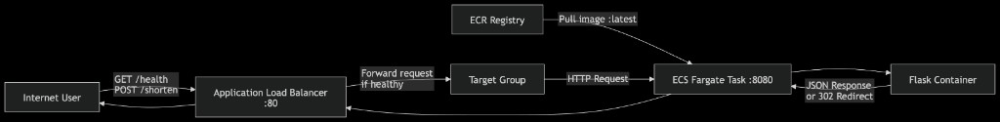
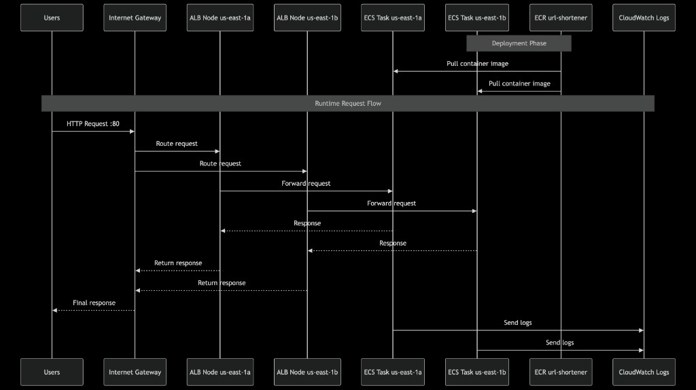
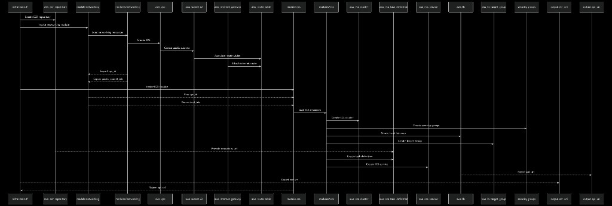
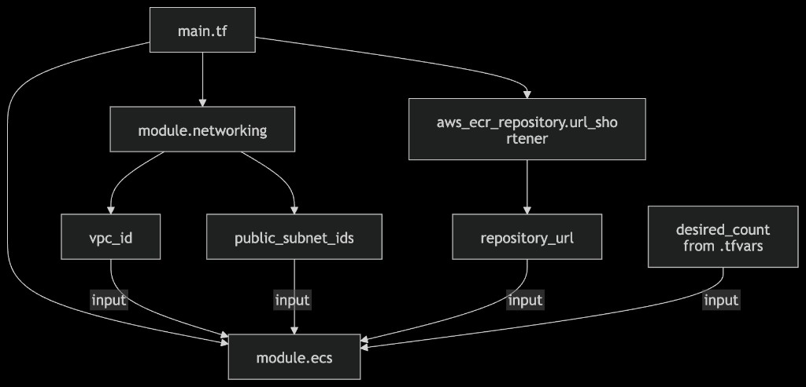
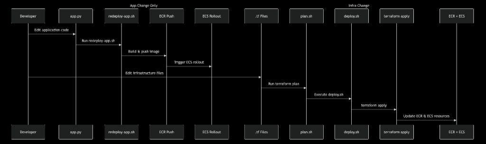

# Infrastructure Guide — Speak Confidently About This Stack

This document explains **what each AWS piece is**, **how traffic flows**, and **how Terraform files connect**. Use it to answer infra questions like a senior engineer.

---

## 1. Big picture in one sentence

**Users hit a public Load Balancer → traffic goes to ECS containers running your Docker image → containers live in a private network (VPC) and pull the image from ECR.**

---

## 2. Traffic flow (request path)

### Request sequence (runtime)



1. User sends `GET /health` or `POST /shorten` to the ALB on port **80**
2. ALB forwards to the target group if the task is **healthy**
3. Target group sends HTTP to the task private IP on port **8080**
4. Flask returns JSON or a **302 redirect**
5. Response returns through ALB to the user

*(At deploy time, ECS pulls the image from ECR — shown at the top of the diagram.)*

### Network topology (VPC)



**Key rule:** Users never connect directly to ECS tasks. They only talk to the ALB.

---

## 3. Core concepts (interview-ready)

### VPC (Virtual Private Cloud)

| | |
|---|---|
| **What** | Your own isolated network in AWS |
| **Why** | Resources (ECS, ALB) need IPs and routing inside a boundary you control |
| **In this project** | `10.0.0.0/16` — 65k+ private IP addresses |
| **File** | `infra/modules/networking/main.tf` → `aws_vpc.main` |

**Analogy:** VPC = fenced campus. Everything you build sits inside the fence.

---

### Subnet

| | |
|---|---|
| **What** | A slice of the VPC IP range in one Availability Zone (data center) |
| **Why** | ALB requires subnets in **≥2 AZs** for high availability |
| **In this project** | `pub_a` = `10.0.1.0/24` (us-east-1a), `pub_b` = `10.0.2.0/24` (us-east-1b) |
| **File** | `aws_subnet.pub_a`, `aws_subnet.pub_b` |

**Analogy:** Subnet = building on the campus. Two buildings so if one AZ fails, the other keeps serving.

`map_public_ip_on_launch = true` → tasks/ALB get public IPs so they can reach the internet (ECR pull, outbound).

---

### Internet Gateway (IGW)

| | |
|---|---|
| **What** | VPC attachment that routes traffic to/from the public internet |
| **Why** | Without IGW, nothing in the VPC reaches the internet |
| **File** | `aws_internet_gateway.main` |

---

### Route table

| | |
|---|---|
| **What** | Rules: “traffic to `0.0.0.0/0` goes to the IGW” |
| **Why** | Subnets must be **associated** with a route table or they cannot route outbound |
| **File** | `aws_route_table.public` + associations `a` and `b` |

---

### Security group (SG)

| | |
|---|---|
| **What** | Virtual firewall on a resource |
| **Why** | Enforce who can talk to whom on which ports |
| **In this project** | |

| SG | Inbound | Outbound |
|----|---------|----------|
| **ALB** (`alb`) | TCP 80 from `0.0.0.0/0` (world) | All |
| **ECS** (`ecs`) | TCP 8080 **only from ALB SG** | All |

**Senior answer:** “We don’t expose ECS to the internet. Only the ALB is public; ECS accepts traffic from the ALB security group on port 8080.”

**File:** `infra/modules/ecs/main.tf` → `aws_security_group.alb`, `aws_security_group.ecs`

---

### Application Load Balancer (ALB)

| | |
|---|---|
| **What** | Layer-7 load balancer with a public DNS name |
| **Why** | Single URL, health checks, spreads traffic across tasks |
| **In this project** | Listens on **80**, forwards to target group |
| **File** | `aws_lb.main`, `aws_lb_listener.http` |

Output: `api_url` = `http://url-shortener-alb-xxx.elb.amazonaws.com`

---

### Target group (TG)

| | |
|---|---|
| **What** | List of backends (ECS task IPs) the ALB sends traffic to |
| **Why** | ALB needs to know where to forward and which targets are healthy |
| **Health check** | `GET /health` every 30s — unhealthy tasks removed |
| **File** | `aws_lb_target_group.app` |

`target_type = "ip"` because Fargate tasks use **task IPs**, not EC2 instance IDs.

---

### ECR (Elastic Container Registry)

| | |
|---|---|
| **What** | Private Docker registry in your AWS account |
| **Why** | ECS pulls images from ECR at task start — not from your laptop |
| **File** | `infra/main.tf` → `aws_ecr_repository.url_shortener` |

Flow: `docker push` → ECR → ECS task pulls `:latest` on deploy.

---

### ECS + Fargate

| | |
|---|---|
| **What** | Service that runs containers; **Fargate** = serverless (no EC2 to manage) |
| **Cluster** | Logical grouping (`url-shortener-cluster`) |
| **Task definition** | Blueprint: CPU, memory, image, env, ports |
| **Service** | Keeps `desired_count` tasks running, registers with ALB |
| **File** | `infra/modules/ecs/main.tf` |

| Setting | Dev | Prod |
|---------|-----|------|
| `desired_count` | 1 | 2 |
| Autoscaling | off | 2–10 on CPU |

---

### IAM role (ECS execution)

| | |
|---|---|
| **What** | Permission for ECS **to pull image** and **write logs** |
| **Why** | Tasks cannot start without ECR + CloudWatch access |
| **File** | `aws_iam_role.ecs_exec` + `AmazonECSTaskExecutionRolePolicy` |

This is **not** your `terraform-user` CLI user. It’s a role the **ECS agent** assumes.

---

### CloudWatch Logs

| | |
|---|---|
| **What** | Container stdout/stderr |
| **Why** | Debug crashes (`exec format error`, Flask errors) |
| **File** | `aws_cloudwatch_log_group.app` → `/ecs/url-shortener` |

---

## 4. How Terraform files link together

### Provision order (`terraform apply`)



### Module inputs and outputs



### Data flow between modules

```
main.tf
  │
  ├─► module.networking
  │     outputs: vpc_id, public_subnet_ids
  │
  ├─► aws_ecr_repository.url_shortener
  │     output: repository_url
  │
  └─► module.ecs
        inputs:
          vpc_id              ← module.networking.vpc_id
          public_subnet_ids   ← module.networking.public_subnet_ids
          ecr_repository_url  ← aws_ecr_repository.url_shortener.repository_url
          desired_count       ← var.desired_count (from .tfvars)
```

**Senior answer:** “Root module owns ECR and wires child modules. Networking module exports VPC and subnets; ECS module consumes those plus the ECR URL to run tasks behind an ALB.”

---

## 5. File-by-file Terraform map

| File | Responsibility |
|------|----------------|
| `infra/main.tf` | Provider, ECR, call modules, root outputs |
| `infra/variables.tf` | Input declarations (`aws_region`, `desired_count`, …) |
| `infra/terraform.tfvars` | Dev values |
| `infra/prod.tfvars` | Prod values |
| `infra/modules/networking/main.tf` | VPC, subnets, IGW, routes |
| `infra/modules/networking/outputs.tf` | `vpc_id`, `public_subnet_ids` |
| `infra/modules/ecs/main.tf` | ECS, ALB, SGs, autoscaling, logs |
| `infra/modules/ecs/outputs.tf` | `api_url` |

---

## 6. Common questions (practice answers)

**Q: Why two subnets?**  
A: ALB requires multi-AZ for availability. If `us-east-1a` has issues, traffic flows through `us-east-1b`.

**Q: Why public subnets for ECS?**  
A: Fargate tasks need outbound internet to pull from ECR. Alternative: private subnets + NAT Gateway (more cost/complexity). We chose public subnets for simplicity.

**Q: What happens on `terraform apply`?**  
A: Terraform creates resources in dependency order: VPC → subnets → IGW → ECR → ALB → ECS cluster → task definition → service → attachments.

**Q: What happens when I push a new Docker image?**  
A: Terraform does **not** auto-redeploy. Run `redeploy-app.sh`: push to ECR, `force-new-deployment`, ECS starts new tasks with `:latest`.

**Q: Why `force_delete` on ECR?**  
A: AWS blocks deleting a repo that still has images. `force_delete` + `destroy.sh` ECR step prevents stuck destroys.

**Q: Why ARM64 in task definition?**  
A: Docker images built on Apple Silicon are `linux/arm64`. Fargate must match or containers fail with `exec format error`.

**Q: Where is `BASE_URL` set?**  
A: ECS task definition env var = ALB DNS. Flask uses it in `short_url` responses.

**Q: What does the ALB health check do?**  
A: Calls `GET /health`. Failing tasks are removed from the target group; ECS replaces unhealthy tasks.

---

## 7. CIDR cheat sheet (this project)

| Resource | CIDR | IPs |
|----------|------|-----|
| VPC | `10.0.0.0/16` | 10.0.0.0 – 10.0.255.255 |
| Subnet A | `10.0.1.0/24` | 10.0.1.0 – 10.0.1.255 |
| Subnet B | `10.0.2.0/24` | 10.0.2.0 – 10.0.2.255 |

---

## 8. Deploy vs redeploy (operations)



| Path | When | Script |
|------|------|--------|
| **App only** | `app.py` / Dockerfile changed | `./scripts/redeploy-app.sh` |
| **Infra** | `infra/*.tf` changed | `./scripts/plan.sh` → `./scripts/deploy.sh` |

---

## 9. Related docs

| Doc | Topic |
|-----|--------|
| [GUIDE.md](./GUIDE.md) | Commands, scripts, local vs AWS |
| [TERRAFORM.md](./TERRAFORM.md) | plan / apply / destroy workflow |
| [PROD.md](./PROD.md) | Production tfvars and testing |

---

*Read `infra/modules/networking/main.tf` and `infra/modules/ecs/main.tf` side-by-side with this doc.*
